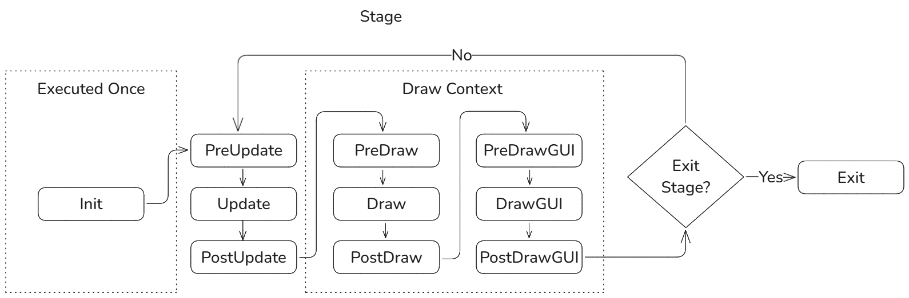

# roberta-game-framework
Game Framework based on Raylib.

# Overview

Due the simplicity and flexibility of Raylib, any kind of framework can be made. In this case, the frameworks is based on
stages and cached object per stage. Once an stage is loaded a number of *steps* are executed sequentially every frame, those follow the next sequence.

